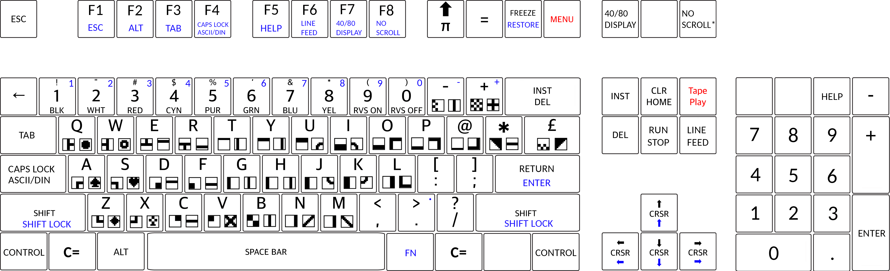

# C128 (unofficial) for [MiSTer](https://github.com/MiSTer-devel/Main_MiSTer/wiki)

*In development, not complete*

Based on [C64_MiSTer](https://github.com/MiSTer-devel/C64_MiSTer) by sorgelig.

Based on FPGA64 by Peter Wendrich with heavy later modifications by different people.

## C128 features implemented

- MMU fully implemented and tested using [VICE test progs](https://sourceforge.net/p/vice-emu/code/HEAD/tree/testprogs/c128/)
- C128 specific keys
- VIC jailbars for the authentic C128 video experience
- VDC standard modes (text & bitmap) and some non-standard modes work
- Selectable colour palettes for the VDC
- Booting in C64, C128 or CP/M mode
- Automatic detection of .CRT files: C64 cartridges boot in C64 mode, C128 cartridges boot in C128 mode. C128 .CRT files must contain a [C128 CARTRIDGE](https://vice-emu.sourceforge.io/vice_17.html#SEC392) header to be detected.
- Loading of .PRG files to the correct memory location in C128 mode.
- Fast serial (external) IEC
- 1571 drive, .d71/.g71 images, including MFM format
- Automatic detection of C64/C128 .PRG files to reset to the appropriate mode.

### C128 features not (yet/fully) implemented

- VIC register $D030 video manipulation tricks (eg. used by RfO part 1)
- VDC non-standard high resolution modes (eg. VGA-like modes)

### Other TODOs and known issues

- Re-enable 3x and 4x turbo modes for 8502
- Turbo mode for Z80
- Other known issues: See [GitHub](https://github.com/eriks5/C128_MiSTer/issues/)

## Usage

### System and drive ROMs

This core does not contain built-in system or drive ROMs. The ROM images will be loaded by the MiSTer on start up of the core.

There are two ways to provide the ROMs for the core: using boot ROM files, or using MRA files. Some features of the core are only available when using MRA files.

#### Using boot ROM files

To boot using rom files, a `boot0.rom` and `boot1.rom` file need to be placed in the `games/C128` directory:

* `boot0.rom` containing the system ROMs in this order:
  * C64 ROM (ROM1, 16k)
  * C128 Kernal (ROM4, 16k)
  * C128 Basic (ROM2+3, 32k)
  * Character ROM (8k)
* `boot1.rom` containing the drive ROMs in this order:
  * 2x 1541 drive ROM (64k total) (repeat 4x if it's a 16k ROM image)
  * 2x 1571 drive ROM (64k total)
  * 2x 1581 drive ROM (64k total)

Each drive's ROM is repeated twice in `boot1.rom`. The first ROM is used for drive 8, the second for drive 9. This makes it possible to use different ROMs in the two drives. The 1541 ROM is 16k and needs to be repeated 4 times to fill the 64k space.

#### Using MRA files

MRA files make it possible to create multiple ROM configurations and easily switch between them using the MiSTer interface. Each configuration will show as a separate item in the Computer cores menu. MRA files were designed for use with the arcade cores, but they also work with computer cores. 

The MRA file configures all system and drive roms as well as (optionally) the internal and external function ROMs. It also contains a configuration parameter that configures the "auto" choice of the CIA, SID and VDC chips and how the Caps Lock key is configured, making it possible to quickly switch between a 1985 flat C128 and a C128DCR hardware setup, and the multitude of international language versions of the C128, and even a "pure" C64 mode.

Using MRA files is the more convenient way to create multiple ROM configurations with the C128 core, but requires the user to make manual changes to the MiSTer file layout as currently the `update_all` script does not support MRA files for computer cores.

The following changes need to be made on the MiSTer SD-CARD or USB drive to use the MRA files:

* Move the core's `C128_XXXXXXXX.rbf` file from the `/_Computer/` folder to a (new) `/_Computer/cores/` folder,
* Download (some of) the `*.mra` files from the [mra directory](mra/) and place them in the `/_Computer/` folder,
* Download [C128rom.zip](mra/C128rom.zip) and place that in the `/games/mame/` folder,

### Internal memory

In the OSD->Hardware menu, internal memory size can be selected as 128K or 256K. The latter activates RAM in banks 2 and 3. C128 basic does not detect this memory however, so it will
still show 122365 bytes free.

### VDC/80 column mode

Video output can be selected using the keyboard. Pressing <kbd>Print screen</kbd> or <kbd>AltGr</kbd>+<kbd>F7</kbd> emulates the <kbd>40/80 display</kbd> toggle switch on the C128 keyboard.
This will also switch which video output is shown on the VGA/HDMI output of the MiSTer.

In OSD->Audio&Video the VDC version, memory size and colour palette can be selected.

There are four colour palettes selectable for the VDC:

* **Default**: the "standard" TTL RGBI colour palette
* **Analogue**: the palette when using resistors to convert TTL RGBI to analogue RGB
* **Monochrome**: TTL monochrome monitor, with two levels of intensity
* **Composite**: the black and white image on the composite pin of the DB9 TTL RGBI connector

### Keyboard
* <kbd>End</kbd> - <kbd>Run stop</kbd>
* <kbd>F2</kbd>, <kbd>F4</kbd>, <kbd>F6</kbd>, <kbd>F8</kbd>, <kbd>Left</kbd>/<kbd>Up</kbd> keys automatically activate <kbd>Shift</kbd> key.
* <kbd>F9</kbd> - <kbd>&#129145;</kbd> key.
* <kbd>F10</kbd> - <kbd>=</kbd> key.
* <kbd>F11</kbd> - <kbd>Restore</kbd> key. Also special key in AR/FC carts.
* Meta keys (Win/Apple) - <kbd>C=</kbd> key.
* <kbd>PgUp</kbd> - Tape play/pause
* <kbd>PgDn</kbd> - <kbd>Line feed</kbd>
* <kbd>Print Screen</kbd> - <kbd>Display 40/80</kbd>
* <kbd>Pause/Break</kbd> - <kbd>No Scroll</kbd> (* see note below)
* Numpad <kbd>*</kbd> - <kbd>Help</kbd>

The <kbd>AltGr</kbd> key (right <kbd>Alt</kbd>) is used to access alternative function keys. Combined with <kbd>AltGr</kbd> the function keys are the C128 top-row special keys. To access these functions, press and hold <kbd>AltGr</kbd> while pressing any of the function keys:
* <kbd>AltGr</kbd>+<kbd>F1</kbd> - <kbd>Esc</kbd>
* <kbd>AltGr</kbd>+<kbd>F2</kbd> - <kbd>Alt</kbd>
* <kbd>AltGr</kbd>+<kbd>F3</kbd> - <kbd>Tab</kbd>
* <kbd>AltGr</kbd>+<kbd>F4</kbd> - <kbd>Caps Lock</kbd> or <kbd>ASCII/DIN</kbd>
* <kbd>AltGr</kbd>+<kbd>F5</kbd> - <kbd>Help</kbd>
* <kbd>AltGr</kbd>+<kbd>F6</kbd> - <kbd>Line feed</kbd>
* <kbd>AltGr</kbd>+<kbd>F7</kbd> - <kbd>40/80 display</kbd>
* <kbd>AltGr</kbd>+<kbd>F8</kbd> - <kbd>No scroll</kbd>

It is possible to access the C128 top-row cursor keys, and the numpad keys on a PC keyboard without numpad using <kbd>AltGr</kbd> combined with the similar keys:
* <kbd>AltGr</kbd>+<kbd>return</kbd> - Numpad <kbd>enter</kbd>
* <kbd>AltGr</kbd>+<kbd>1</kbd> through <kbd>0</kbd> - Numpad <kbd>1</kbd> through <kbd>0</kbd>
* <kbd>AltGr</kbd>+<kbd>-</kbd> - Numpad <kbd>-</kbd>
* <kbd>AltGr</kbd>+<kbd>+</kbd> - Numpad <kbd>+</kbd>
* <kbd>AltGr</kbd>+<kbd>.</kbd> - Numpad <kbd>.</kbd>
* <kbd>AltGr</kbd>+Cursor keys - Top-row cursor keys (** see note below)

<kbd>Shift lock</kbd> can be activated by pressing <kbd>AltGr</kbd>+<kbd>Shift</kbd>. This is a toggle, to release <kbd>Shift lock</kbd>, press the <kbd>AltGr</kbd>+<kbd>Shift</kbd> combination again.

Keys marked in blue are the keys sent when combined with <kbd>AltGr</kbd>.

*): The <kbd>Pause/Break</kbd> key acts like the <kbd>No scroll</kbd> key, however the <kbd>Pause/Break</kbd> PC key is special as it does not send a signal when it is released. To solve this, when the <kbd>Pause/Break</kbd> key is pressed, the <kbd>No scroll</kbd> key signal to the C128 is pulsed for short period. To hold <kbd>No scroll</kbd> on the C128 for longer, either use <kbd>AltGr</kbd>+<kbd>F8</kbd>, or quickly double press <kbd>Pause/break</kbd> and press any key to release <kbd>No scroll</kbd>.

**): When the Z80 CPU is active the top-row cursor keys become the default and <kbd>AltGr</kbd> selects the regular cursor keys.

## C128 cartridges

To load a cartridge - "External function ROM" in C128 terms - it must be in .CRT format. To convert a binary ROM image into a .CRT, the
[cartconv](https://vice-emu.sourceforge.io/vice_15.html) tool from Vice can be used, usually like this:

`cartconv.exe -t c128 -l 0x8000 -i cart.bin -o cart.crt`

The `-t c128` option is needed to create the correct header indicating this is a C128 cartridge. Otherwise the cartridge will be detected
as a C64 cartridge and the core will start up in C64 mode like a real C128 would do if a C64 cartridge is inserted.

The `-l 0x8000` option is needed to indicate the image should be located at address $8000. Some external ROMs might need to be located at $C000,
in that case `-l 0xC000` should be used.

### USER_IO pins

| USER_IO | USB 3.0 name | Signal name |
|:-------:|:-------------|:------------|
| 0       |    D+        | RS232 RX    |
| 1       |    D-        | RS232 TX    |
| 2       |    TX-       | IEC /CLK    |
| 3       |    GND_d     | IEC /RESET  |
| 4       |    RX+       | IEC /DATA   |
| 5       |    RX-       | IEC /ATN    |
| 6 :new: |    TX+       | IEC /SRQ    |

All signals are 3.3V LVTTL and must be properly converted to required levels!

The IEC /SRQ (USER_IO6) line is required for IEC fast serial operation with an external 157x or 1581 drive.
You will need a MiSTer user port adapter that connects the /SRQ line. 
Assume a MiSTer user port to IEC adapter does not connect this line unless it is explicitly stated that it supports the C128 fast serial protocol.

# C64 features

The following is the original C64_MiSTer README. Some features still apply, others don't:

## Features
- C64 and C64GS modes.
- C1541 read/write/format support in raw GCR mode (*.D64, *.G64)
- C1581 read/write support (*.D81)
- Parallel C1541 port for faster (~20x) loading time using DolphinDOS.
- External IEC through USER_IO port.
- Amost all cartridge formats (*.CRT)
- Direct file injection (*.PRG)
- Dual SID with several degree of mixing 6581/8580 from stereo to mono.
- Similar to 6581 and 8580 SID filters.
- REU 16MB and GeoRAM 4MB memory expanders.
- OPL2 sound expander.
- Pause option when OSD is opened.
- 4 joysticks mode.
- RS232 with VIC-1011 and UP9600 modes either internal or through USER_IO.
- Loadable Kernal/C1541 ROMs.
- Special reduced border mode for 16:9 display.
- C128/Smart Turbo mode up to 4x.
- Real-time clock

## Installation
Copy the *.rbf to the root of the SD card. Copy disks/carts to C64 folder.

## Usage

### Using without keyboard
If your joystick/gamepad has more than 4 buttons then you can have some limited usage of keyboard.
Joystick buttons **Mod1** and **Mod2** adds 12 frequently used keys to skip the intros and start the game.
Considering default button maps RLDU,Fire1,Fire2,Fire3,Paddle Btn, following keys are possible to enter:
* With holding **Mod1**: Cursor RLDU, Enter, Space, Esc, Alt+ESC(LOAD"*" then RUN)
* With holding **Mod2**: 1,2,3,4,5,0,Y,N
* With holding **Mod1+Mod2**: F1,F2,F3,F4,F5,F6,F7,F8

With maps above and using Dolphin DOS you can issue **F7** to list the files on disk, then move cursor to required file, then issue **Alt+ESC** to load it and run.

### ~~Loadable ROM~~
*(**not** applicable to C128_MiSTer)*

~~Alternative ROM can loaded from OSD: Hardware->Load System ROM.
Format is simple concatenation of BASIC + Kernal.rom + C1541.rom~~

~~To create the ROM in DOS or Windows, gather your files in one place and use the following command from the DOS prompt.
The easiest place to acquire the ROM files is from the VICE distribution. BASIC and KERNAL are in the C64 directory,
and dos1541 is in the Drives directory.~~

~~`COPY BASIC + KERNAL + dos1541 MYOWN.ROM /B`~~

~~To use JiffyDOS or another alternative kernel, replace the filenames with the name of your ROM or BIN file.  (Note, you muse use the 1541-II ROM. The ROM for the original 1541 only covers half the drive ROM and does not work with emulators.)~~

~~`COPY /B BASIC.bin +JiffyDOS_C64.bin +JiffyDOS_1541-II.bin MYOWN.ROM`~~

~~To confirm you have the correct image, the BOOT.ROM created must be exactly 32768 or 49152(in case of 32KB C1541 ROM) bytes long.~~

~~There are 2 loadable ROM sets are provided: **DolphinDOS v2.0** and **SpeedDOS v2.7**. Both ROMs support parallel Disk Port. DolphinDOS is fastest one.~~

~~For **C1581** you can use separate ROM with size up to 32768 bytes.~~

### Autoload the cartridge
In OSD->Hardware page you can choose Boot Cartridge, so everytime core loaded, this cartridge will be loaded too.

### Parallel port for disks.
Are you tired from long loading times and fast loaders aren't really fast when comparing to other systems?

Here is the solution:
In OSD->System page choose **Expansion: Fast Disks**. Then load [DolphinDOS_2.0.rom](releases/DolphinDOS_2.0.rom). You will get about **20x times faster** loading from disks!

### Turbo modes
*(**not** applicable to C128_MiSTer, C128 mode is always active)*

~~**C128 mode:** this is C128 compatible turbo mode available in C64 mode on Commodore 128 and can be controlled from software, so games written with this turbo mode support will take advantage of this.~~

~~**Smart mode:** In this mode any access to disk will disable turbo mode for short time enough to finish disk operations, thus you will have turbo mode without loosing disk operations.~~

### RS232

Primary function of RS232 is emulated dial-up connection to old-fashioned BBS. **CCGMS Ultimate** is recommended (Don't use CCGMS 2021 - it's buggy version). It supports both standard 2400 VIC-1011 and more advanced UP9600 modes.

**Note:** DolphinDOS and SpeedDOS kernals have no RS232 routines so most RS232 software don't work with these kernals!

### GeoRAM
*(untested in C128_MiSTer, probably only works in C64 mode)*

Supported up to 4MB of memory. GeoRAM is connected if no other cart is loaded. It's automatically disabled when cart is loaded, then enabled when cart unloaded.

### REU
Supported standard 512KB, expanded 2MB with wrapping inside 512KB blocks (for compatibility) and linear 16MB size with full 16MB counter wrap.
Support for REU files.

GeoRAM and REU don't conflict each other and can be both enabled.

### Real-time clock

RTC is PCF8583 connected to tape port.
To get real time in GEOS, copy CP-CLOCK64-1.3 from supplied [disk](https://github.com/mister-devel/C64_MiSTer/blob/master/releases/CP-ClockF83_1.3.D64) to GEOS system disk.

### Raw GCR mode

C1541 implementation works in raw GCR mode (D64 format is converted to GCR and then back when saved), so some non-standard tracks are supported if G64 file format is used. Support formatting and some copiers using raw track copy. Speed zones aren't supported (yet), but system follows the speed setting, so variable speed within a track should work.
Protected disk in most cases won't work yet and still require further tuning of access times to comply with different protections.

